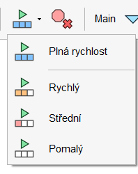
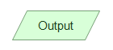

# Obsah
- [Základní pojmy](#základní-pojmy)
  - [Algoritmus-definice](#algoritmus--definice)
  - [Vlastnosti algoritmu](#vlastnosti-algoritmu)
  - [Způsoby zápisu algoritmů](#zp%C5%AFsoby-z%C3%A1pisu-algoritm%C5%AF)
  - [Flowgorithm](#flowgorithm)
- [Proměnná](#prom%C4%9Bnn%C3%A1)
  - [Jak zapisovat proměnné](#jak-zapisovat-prom%C4%9Bnn%C3%A9)
  - [Datové typy](#datov%C3%A9-typy)
  - [Deklarace a inicializace](#deklarace-a-inicializace)
- [Output/Input](#outputinput)
  - [Output](#output)
  - [Input](#input)
- [Matematické operace](#matematick%C3%A9-operace)
- [Podmínka](#podm%C3%ADnka)
  - [Rozdíl mezi přiřazením a porovnáním](#rozd%C3%ADl-mezi-p%C5%99i%C5%99azen%C3%ADm-a-porovn%C3%A1n%C3%ADm)
  - [Vnořená podmínka](#vno%C5%99en%C3%A1-podm%C3%ADnka)
- [Výroková logika](#v%C3%BDrokov%C3%A1-logika-and-or-not)
  - [AND](#and)
  - [OR](#or)
  - [NOT](#not)
- [Boolean](#boolean)
- [Pole](#pole)
- [Cykly](#cykly)
  - [While](#while)
  - [For](#for)
  - [Do while](#do-while)

# Základní pojmy
## Algoritmus – definice
* Algoritmus je přesně definovaná posloupnost kroků nebo procedur, které řeší určitý 
problém nebo vypočítávají určitý výsledek

## Vlastnosti algoritmu
* Konečnost - Algoritmus musí být konečný, což znamená, že musí se dát dokončit v konečném počtu kroků
* Vstup - Algoritmus musí přijmout nějaký vstup.
* Výstup - Algoritmus musí poskytnout nějaký výstup
* Přesnost - Algoritmus musí být přesný a dobře definovaný, aby každý, kdo ho používá, mohl dosáhnout stejného výsledku.
* Škálovatelný - obecný zápis, použití na více problémů, snadné rozšíření
## Způsoby zápisu algoritmů
* Vývojový diagram
  * Je grafický způsob zápisu algoritmu, kde jsou jednotlivé kroky reprezentovány 
různými symboly jako například příkazy, rozhodování a podmínky
  * Tyto symboly jsou propojeny šipkami, které ukazují, jak jsou jednotlivé kroky 
propojeny

* Pseudokód
  * Je způsob zápisu algoritmu, který používá běžné jazykové konstrukce a syntaxi, 
ale bez nutnosti dodržovat přesná pravidla konkrétního programovacího 
jazyka
  * Pseudokód umožňuje programátorovi zapsat algoritmus v podobě, kterou lze 
snadno pochopit a převést na zdrojový kód v konkrétním jazyce

## Flowgorithm

Program na tvorbu vývojových diagramů.

[Odkaz na stažení programu](http://www.flowgorithm.org/download/index.html)

Na stránkách mají vypracovanou dokumentaci pro práci s programem.

[Dokumentace](http://www.flowgorithm.org/documentation/index.html)

### Přidávání schématických značek
Pro přidání schématické značky stačí rozkliknout šipku mezi počátečním a konečným nodem.

Pro zapsání do schématické značky stačí dvakrát na ni kliknout.

### Ovládací menu

  Slouží pro otevření uložených vývojových diagramů. Lze otevřít soubory s koncovkou .fprg.

 Pro ukládání souborů.

 Spouští konzoli a algoritmus.

 Umožňuje procházet algoritmem po jednotlivých krocích.

 Zastaví průchod algoritmem na aktuálním kroku. Je možno znovu spustit od kroku kde se zastavil.

 Ukončí průchod a při příším spuštění začne od znovu.

Mění tempo přehrávání algoritmu.

> [!TIP]
> Pokud porgram spustíte a dlouho trvá provádění jednotlivých kroků, není to pomalým počítačem ale je to tohle tlačítko. Stačí přepnout zpátky na plnou rychlost.
> 
> 

# Proměnná
* Proměnná je hodnota která se v průběhu programu mění a mohou v ní být uloženy různé typy dat.
* Když vytváříme proměnnou musíme uvést její datový typ (druh dat, které můžeme do proměnné uložit) a název
## Jak zapisovat proměnné
* Je jedno jestli anglicky nebo česky
* Pokud budete proměnnou zapisovat česky zapisujte ji bez diakritiky (věk -> vek)
* Pro víceslovné proměnné jsou dvě konvence zápisu CamelCase a snake notace
* Camel case - napíšeme všechna slova dohromady první slovo malé písmenko na začátku a každé další slovo velké písmenko na začátku (jmenoMehoPsa)
* snake notace - mezi všechna slova napíšeme podtržítka (jmeno_meho_psa)
## Datové typy
* Typ nebo rozsah hodnot kterých může proměnná nabývat
* Druhy
  * Integer (int) – Celé číslo – 1, 2, 8, -5
  * String – Textový řetězec – „Hello world“
  * Real – Reálné číslo (záporná, kladná, desetinná) – 3, 4, -5, 3.5, -2.1
  * Boolean – hodnota pravda/nepravda – true/false
## Deklarace a inicializace
### Deklarace
* Každou proměnnou je před jejím použitím potřeba deklarovat
* Deklarování vlastně říká programu, že chceme vytvořit proměnnou s určitým jménem a můžeme do ní vložit určitý typ dat
* Pro deklaraci proměnné musíme zapsat datový typ a název
> [!NOTE]
> Používejte názvy proměnných tak abyste dokázali rozeznat co je v ní uloženo. proměnná a, b není dobrý název
* Příklad zápisu: String name;

Ve Flowgorithm je to tato značka.
Po rozkiknutí vás vyzve k zadání názvu a datového typu.

### Inicializace
* Přiřazení konkrétní hodnoty do proměnné
* Příklad: name = "Helena";
* Hodnotu máme již deklarovanou z předchzího kroku a zde jsme jen přiřadili hodnotu
 

Ve Flowgorithm je to tato značka.

# Output/Input
* Po spuštění algoritmu se otevře konzole, vstup a výstup slouží k interakci s touto konzolí 
## Output
* Výstup - slouží pro vypsání do konzole
* Můžeme například vypsat instrukce pro uživatele, to co máme uloženo v proměnné nebo výsledek matematické operace
* Pokud chceme vypsat text musíme ho vložit do uvozovek ("text"), pokud chceme vypsat co je uvnitř proměnné stačí nám k tomu její název (nazevPromenne)

* ve flowgorithm je to tato značka

## Input
* Vstup (input) - slouží pro získání vstupu od uživatele
* Umožní uživateli odpovídat a interagovat s konzolí
* Při vytváření proměnné je potřeba zadat proměnnou kam budeme vstup od uživatele ukládat

* ve flowgorithm je to tato značka

# Matematické operace
* Seznam základních matematických operací
  * Sčítání (+) - 10+5=15
  * Odčítání (-) - 10-5=5

  * Násobení () - 105=50
  * Dělení (/) - 10/5=2
  * Modulo (zbytek po celočíselném dělení)(%) - 10%5=0 , 10%4=2
    * Nejdřív se provede dělení a pak se vypíše zbytek (modulo vrátí pouze zbytek)
  * Mocnina (^) - 10^2=100 (deset na druhou)
  * Odmocnina (sqrt(n)) - sqrt(25)=5
    
> [!NOTE]
> Pokud vám modulo vypíše jako výsledek 0 nutně to neznamená, že tam máte chybu.
> Znamená to že jste dvě čísla mezi sebou vydělili beze zbytku

* Další
  * random(n) - vypíše náhodné číslo od 0 do zadaného čísla n-1, pokud zadáme random(50) nejmenší možné číslo je 0 a největší 49
  * pi - konstanta pro práci s Pí
    
# Podmínka
* Slouží k rozvětvení toku algoritmu
  
  

* Do těla podmínky je vždy potřeba zapsat nějaký výrok, který lze vyhodnotit jako true nebo false (pravdivý/nepravdivý)
* Podmínka se vyhodnotí a podle výsledku algoritmus pokračuje buď pravou nebo levou větví

## Rozdíl mezi přiřazením a porovnáním
### Přiřazení
* Pro přiřazení se používá =

* Je to vložení určité hodnoty do proměnné

### Porovnání dvou výrazů
* Pro porovnání se používá ==
* Porovnáváme levou stranu s pravou
* Výsledkem porovnání je hodnota true/false

### Matematické porovnání
* Slouží k porovnání dvou čísel
* Větší než - >
* Menší než - <
* Větší nebo rovno - >=
* Menší nebo rovno - <=
* Rovno - ==

## Vnořená podmínka
* Vnořená podmínka znamená že uvnitř podmínky je podmínka další
* Příklad:

# Výroková logika AND OR NOT
* Výrok je tvrzení které lze jednoznačně vyhodnotit jako true/false
* Příklad: Venku prší.
* Hodnota true – 1
* Hodnota False – 0
## AND
* značka &&
* vrací true pokud jsou oba výroky pravdivé
## OR
* značka ||
* vrací true pokud je pravdivý alespoň jeden
## NOT
* značka !
* obrátí každý výrok na výrok opačný
* !true = false
# Boolean
* Datový typ do kterého můžeme ukládat hodnotu true a false

# Pole

# Cykly
## While
## For
## Do while

